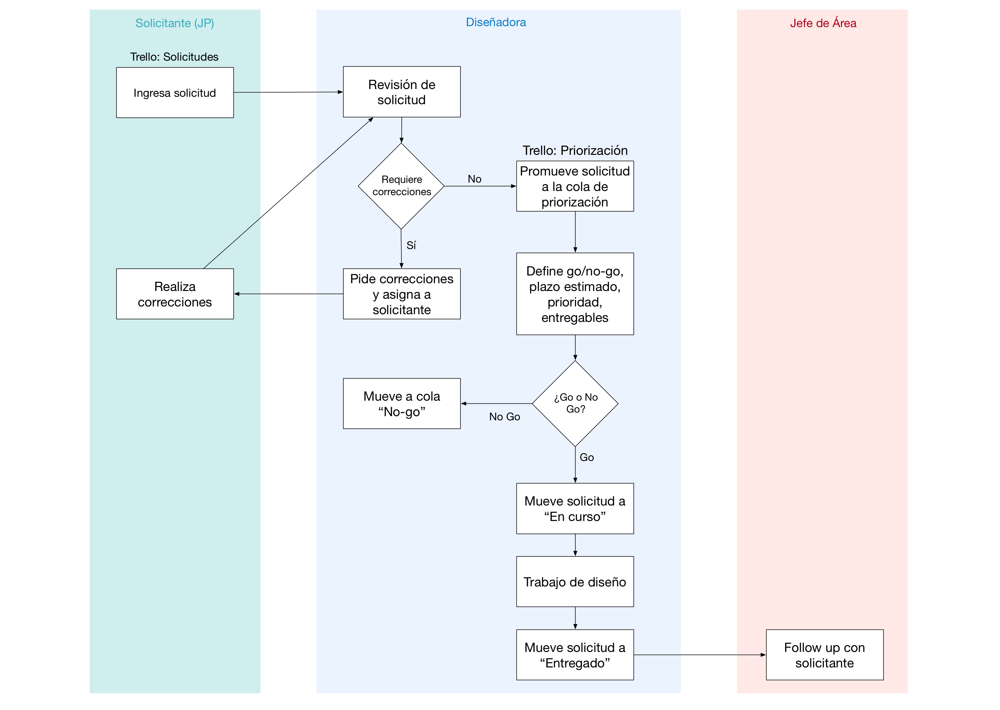
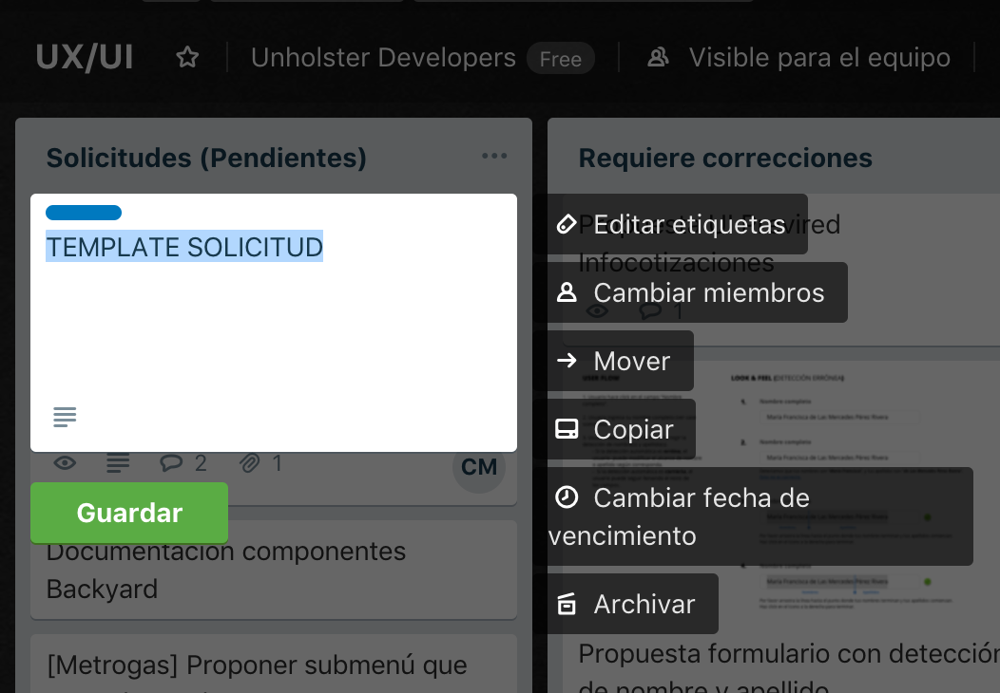
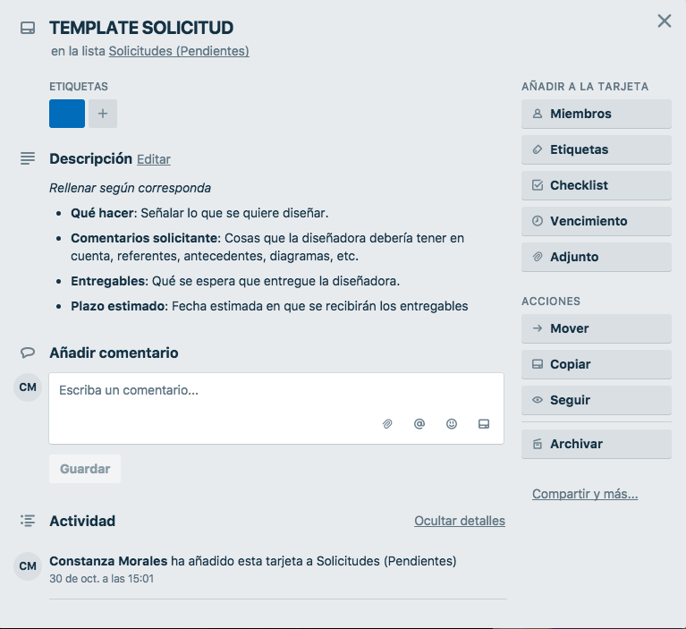

# Flujo de trabajo de diseño UI/UX

Este flujo de trabajo es un intento por mejorar la relación entre diseño y desarrollo en Unholster, con el objetivo de obtener mejores resultados a través de trabajo colaborativo.

## Participantes:
 - **Jefe/a de Proyecto (JP)**: Es quien realiza las solicitudes de diseño.
 
 - **Diseñador(a)**: Encargado/a de revisar las solicitudes, pedir correcciones en caso que corresponda, mover y priorizar solicitudes en Trello, diseñar y entregar deliverables (wireframes, mock-ups, prototipos de alta o baja fidelidad, guías de estilo, correcciones, etc).
 
 - **Jefe de Área**: Se encarga de seguir el proceso desde que la solicitud es ingresada hasta que se entrega, haciendo un follow-up cuando el intercambio entre diseñador(a) y desarrollador(a) concluya.

## Diagrama de trabajo

## Solicitudes
Para cumplir con este flujo de trabajo, se usará Trello como medio de intercambio (junto con Slack) entre Jefe de Proyecto y diseñador(a). **Todo trabajo de diseño que suponga un esfuerzo significativo * deberá pedirse mediante una solicitud**.

**Que suponga más de 1 hora de trabajo. Se omitirán cosas como: cambio de colores en detalles pequeños, cambios en tipografía, corrección de palabras en el contenido de las interfaces, cambio de imágenes en las interfaces, actualización de mockups en Invision o Zeplin.*

Para agregar una solicitud se siguen los siguientes pasos:

#### 1. Copiar template solicitud
Cada solicitud de diseño debe ser ingresada por el Jefe de Proyecto en una card de Trello. Para ello, se debe copiar la card con nombre **TEMPLATE SOLICITUD**

Se cambia el título de la card, siguiendo el formato:
 ``[Empresa o nombre de proyecto] Nombre de la solicitud`` 

 
 Ejemplos:
 ``[Metrogas] Corregir tabla de datos``
 ``[Portal de pagos] - Actualizar íconos y tipografía``
 
#### 2. Reemplazar contenido
Dentro del card **TEMPLATE SOLICITUD** se encontrarán las especificaciones de la solicitud. Basta con reemplazar el texto explicativo y rellenar según corresponda.

**IMPORTANTE**: El campo "*Plazo estimado*" será llenado por el/la diseñador(a) una vez se tenga clara la fecha de vencimiento (que el Jefe de Proyecto definirá en la misma card). En esta etapa se dejará el espacio en blanco hasta que la solicitud sea leída y aceptada por el/la diseñador(a).

## Correcciones a una solicitud

El o la diseñador(a) podrá pedir correcciones al Jefe de Proyectos sobre la solicitud cuando falte cierta profundidad o claridad para entender lo que se pide. Para evitar estas instancias, se debe asegurar que la solicitud ingresada en Trello sea lo más clara posible, esto se puede lograr mediante:
 
- Una correcta y clara descripción de lo que se pide.

- Imágenes, sitios, componentes y links de referencia en caso de que se haga difícil explicar la solicitud o se quiera algo específico.

- Reunión antes de crear la solicitud (que puede incluir dibujos en pizarra, lápiz y papel, brainstorming, diagramas de flujo, wireframes a mano alzada, etc).

